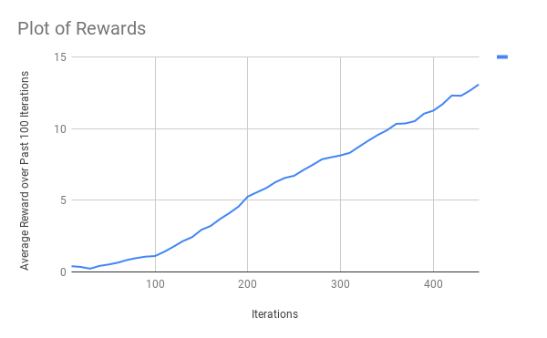

# Navigation Report

## Learning Algorithm

The learning algorithm consists of a four-layer deep Q network (DQN).  All the layers are fully connected.
The first and second layer have 128 units, the third has 32, the fourth has 16 and outputs 4 values, corresponding 
to the number of actions. These values were chosen by hand tuning.  The ReLU activation function is used
for each layer except the last, which is linear.

The algorithm works by creating two DQNs, a local and a target network.  At each state, the agent's act
method is called with the state and an action is returned.  The action is chosen according to an epsilon-greedy
policy. The action is sent to the environment and a new environment state and reward is returned.  This new
state and reward are passed into the agent via the step method.  This step method adds the experience to a
fixed-size memory buffer and, at regular intervals, samples and updates weights based on these experiences by
calling the learn method.

The learn method updates the weights of the local network in the direction to minimize a loss function.  The error
of the loss function is chosen by using a target network to select the action and Q-values for the next state.  These
Q-values are used to generate Q-targets by using the reward and the discounted estimated future reward.  The MSE loss
is then generated between the Q-values of the local network and the Q-targets of the target network.

The hyperparameters are:
* Epsilon start: Epsilon controls the amount we explore vs exploit for our epsilon-greedy algorithm.  We decay epsilon over
time and this parameter says where we start with epsilon.
* Epsilon end: The minimum value that epsilon can be.
* Epsilon decay: A mulitplicative factor for decreasing epsilon.
* Max time steps: Each time we reset the environment, this is the most time steps we can run for.  The episode can
terminate early if the done variable gets set by the environment.
* Buffer size: The maximum size of the buffer for experience replay.  It's defaulted to 1e5.  I haven't experimented
with changing this.
* Batch size: When the experiences are sampled from the buffer in experience replay, this controls the mini-batch size.
I lowered this from 64 to 32 and noticed a small benefit.
* Gamma: This is the discount factor and set to 0.99.  This affects the weight of future rewards.
* Tau: When the soft update is ran to update the weights of the local network, this hyperparameter affects how much
we update.
* LR: The learning rate for our Adam optimizer.
* Update every: Controls how many time steps we need to go before learning occurs.

## Plot of Rewards

## Ideas for Future Work

There are many possible improvements to this algorithm.
* Double DQN: Instead of using the target network to select both the action and Q-value for the next state, use
the local network to select the action and the target network to select the Q-value.
* Dueling DQN: Use fully connected layers to estimate the state values and advantage values and combine these
at the end.
* Prioritized Experience Replay: Experience replay selects the experiences using a uniform distribution, but we
can benefit by making experiences with a higher TD error more likely to be chosen.
* Rainbow: The above three improvements, plus three more: learning from multi-step bootstrap targets, distributional
DQN and noisy DQN.
* Convolutional Network: Finally, we could learn directly from the pixels in the banana environment!  This would
involve using convolutional layers in front of our fixed layers.
